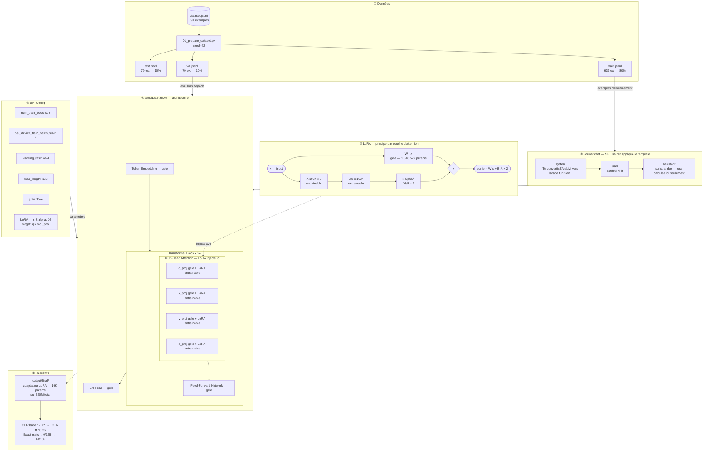

# arabzi2tounsi

Fine-tuning d'un petit LLM pour translittérer le tunisien écrit en Arabizi (latin) vers le script arabe.

**Exemple**
```
sbeh el khir  →  صباح الخير
nheb nrou7    →  نحب نروح
ma n9addarch  →  ما نقدرش
```

---

## Objectif pédagogique

Ce projet est un tutoriel complet de fine-tuning SFT (Supervised Fine-Tuning) avec LoRA sur un cas concret et simple. Il couvre :

- Construction d'un dataset au format chat
- Fine-tuning avec LoRA via PEFT + TRL
- Évaluation quantitative (CER) et qualitative

---

## Stack

| Composant | Choix |
|-----------|-------|
| Modèle de base | `HuggingFaceTB/SmolLM2-360M-Instruct` |
| Fine-tuning | LoRA (`r=8`, `alpha=16`) via PEFT |
| Trainer | `SFTTrainer` (TRL) |
| GPU | Google Colab T4 |

---

## Dataset

791 paires Arabizi → arabe tunisien oral, construites manuellement.
Couvre : salutations, verbes conjugués, négations, questions, famille, émotions, vie quotidienne.

Format :
```json
{"input": "kifeh 7alek", "output": "كيفاش حالك"}
```

---

## Architecture



Points clés :
- **Gele** : les 360M poids du modèle de base ne sont pas modifiés
- **Entrainable** : seulement les matrices A et B de LoRA (~16K params)
- La loss est calculée uniquement sur les tokens `assistant`, pas sur le system ni le user
- L'adaptateur sauvegardé est indépendant du modèle de base

---

## Résultats

Métrique : **CER** (Character Error Rate) — 0 = parfait, 1+ = mauvais.

| Modèle | CER moyen | Exact match |
|--------|-----------|-------------|
| Base (sans fine-tuning) | 2.72 | 0 / 135 |
| Fine-tuné (3 epochs, LoRA) | 0.26 | 14 / 135 |

Le modèle de base recrache l'Arabizi ou hallucine. Le modèle fine-tuné produit systématiquement du script arabe, avec des erreurs résiduelles sur les caractères proches (خ/ك, ن/ع).

---

## Reproduire

**Prérequis** : Python 3.13+, `uv`

```bash
# 1. Installer les dépendances
uv sync

# 2. Préparer les splits (train / val / test)
uv run python 01_prepare_dataset.py

# 3. Fine-tuning (recommandé sur GPU)
uv run python 02_train.py

# 4. Évaluation base vs fine-tuné
uv run python 03_evaluate.py
```

Sur **Google Colab** (GPU T4 gratuit) : ouvrir `colab_run.ipynb` et suivre les cellules dans l'ordre.

---

## Limites et pistes d'amélioration

- 791 exemples → CER 0.26 : encore trop élevé pour un usage réel
- Augmenter le dataset à ~3000 exemples serait le levier principal
- La tâche est simple mais le modèle confond encore des caractères proches (خ/ك, ن/ع)
- Prochaine étape possible : explorer DPO si on veut affiner les préférences de sortie
